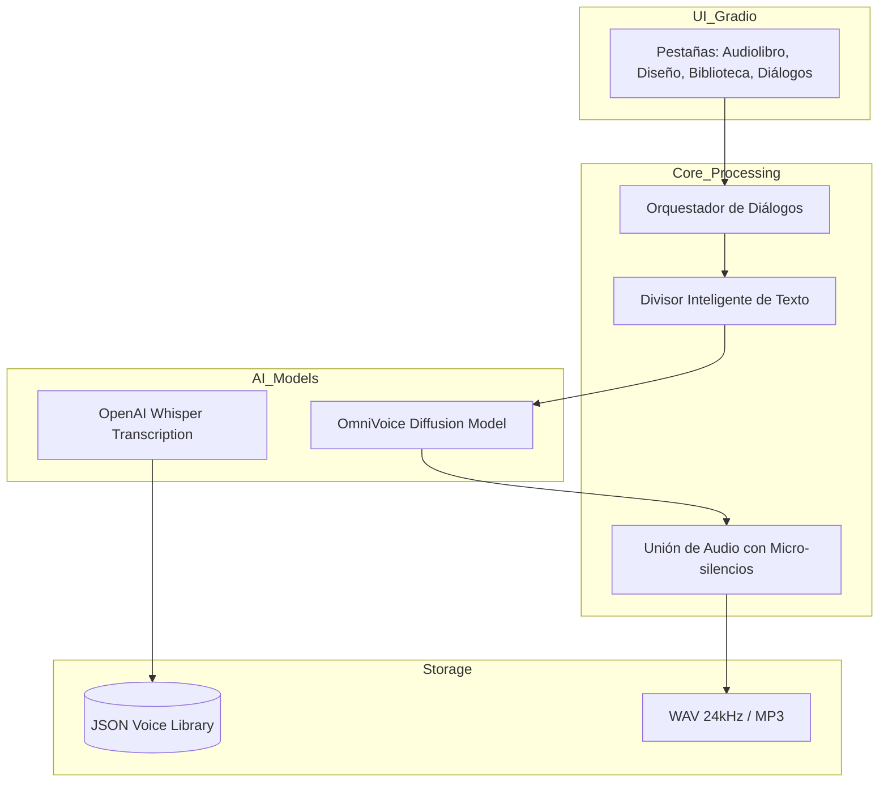

# 🎙️ OmniBook Studio: Estación de Producción de Audio con IA Agentica

[](https://opensource.org/licenses/Apache-2.0)
[](https://www.python.org/downloads/)
[](https://pytorch.org/)

**OmniBook Studio** es una plataforma avanzada de síntesis de voz (TTS) diseñada para creadores de contenido, escritores y productores de audio. Utilizando el motor de **OmniVoice**, permite transformar texto en producciones sonoras profesionales con clonación instantánea, diseño de voces por atributos y una potente suite de generación de diálogos.

---

## 🏗️ Arquitectura del Sistema

OmniBook utiliza un flujo de procesamiento híbrido que combina modelos de difusión de audio con una orquestación inteligente de fragmentos para garantizar fluidez y calidad.



---

## 🔥 Funcionalidades Destacadas

### 🎭 Generador de Diálogos Multivoz (¡NUEVO!)
Crea escenas cinematográficas o podcasts completos desde un guion. El sistema analiza automáticamente quién habla y asigna la voz correspondiente de tu biblioteca.
- **Micro-pausas inteligentes:** Inserción automática de 300ms entre voces para una naturalidad superior.
- **Estabilidad de Puntuación:** Algoritmo que evita cortes abruptos al final de las oraciones.
- **Mapeo Flexible:** Asignación dinámica de personajes mediante formato JSON.

### 🎙️ Clonación de Voz Zero-Shot
Clona cualquier voz con solo **10 segundos** de audio de referencia. Sin necesidad de entrenamiento (fine-tuning), manteniendo el tono, acento y matices originales.

### 🎨 Diseño de Voces Personalizado
Crea voces únicas que no existen en el mundo real combinando atributos:
- **Género y Edad:** Desde niños hasta ancianos.
- **Tono y Estilo:** Voces graves, agudas o susurrantes (ASMR).
- **Acentos:** 600+ idiomas soportados con acentos regionales.

### 🛠️ Herramientas de Producción
- **Auto-Transcripción:** Generación de texto de referencia mediante Whisper.
- **Conversor Multiformato:** Exportación a WAV, MP3, OGG, FLAC y M4A.

---

## 🚀 Instalación Profesional

### Requisitos de Hardware
- **Mínimo:** NVIDIA GTX 1660 (6GB VRAM).
- **Recomendado:** NVIDIA RTX 3060/4050+ (8GB+ VRAM).
- **RAM:** 16GB+.

### Pasos de Despliegue
```bash
# 1. Clonar repositorio
git clone https://github.com/tu-usuario/OmniBook.git
cd OmniBook

# 2. Configurar entorno virtual (Recomendado uv)
uv sync
.venv\Scripts\activate

# 3. Iniciar estudio de producción
python app.py
```
Acceso web: **`http://127.0.0.1:7860`**

---

## 📖 Guía de Uso: Diálogos Multivoz

Para crear una producción multivoz, utiliza el siguiente formato:

1. **Guion:**
   ```text
   Narrador: La mañana era fría en el puerto.
   Capitán: ¡Levad anclas, marineros!
   ```
2. **Mapeo (JSON):**
   ```json
   {
     "Narrador": "📖 Narrador Profesional",
     "Capitán": "🎙️ Locutor Epico"
   }
   ```

---

## 🚧 Roadmap de Innovación (MVP Avanzado)

- [ ] **Ambientes Sonoros:** Mezclador de música de fondo y efectos ambientales (lluvia, oficina, etc.).
- [ ] **Traducción con Identidad:** Traducir audios a 600 idiomas manteniendo la voz original del usuario.
- [ ] **Control de Timing:** Inserción de pausas personalizadas mediante tags `[pausa: 2s]`.
- [ ] **API Endpoint:** Servidor dedicado para integración con aplicaciones externas y juegos.

---

## 👨‍💻 Autor
Proyecto enfocado en la democratización de la producción de audio de alta calidad mediante Inteligencia Artificial Local.

---
**Licencia:** Apache 2.0
